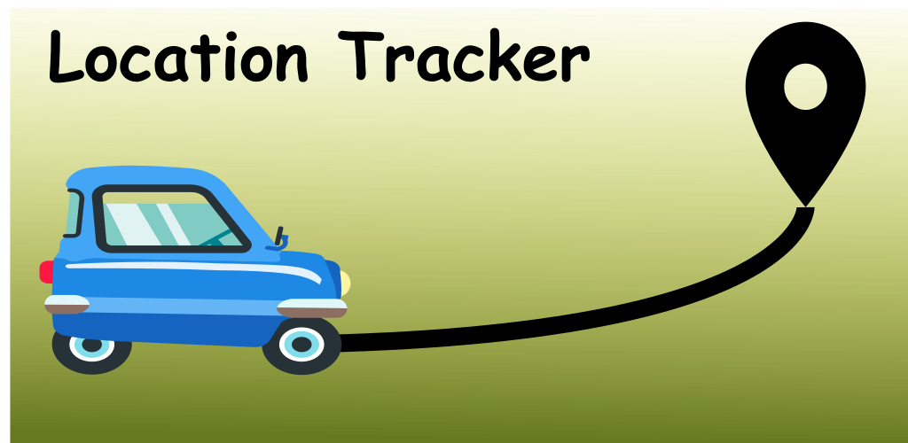

# Location Tracker [Google Play Link](https://play.google.com/store/apps/details?id=eu.wonderfulme.locationtracker)

## Overview:
Have you ever tried to save the route you go? Going on a road-trip and don't know how to save your route? Do you need the coordinates of where you go on a file?

Location tracker is the easiest way to save your location in background and export coordinates to a CSV file.

Just open the app, click on the Play button and done! Put the app on background while it saves location.
By clicking on Stop icon, you will get a CSV file in your Downloads. Is easier possible?!

## Third-party libraries
* [OpenCSV](http://opencsv.sourceforge.net/)
* [Room Persistence Library](https://developer.android.com/topic/libraries/architecture/room)
